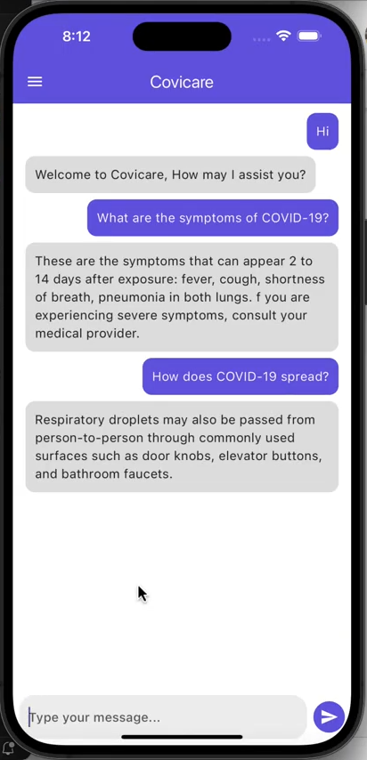
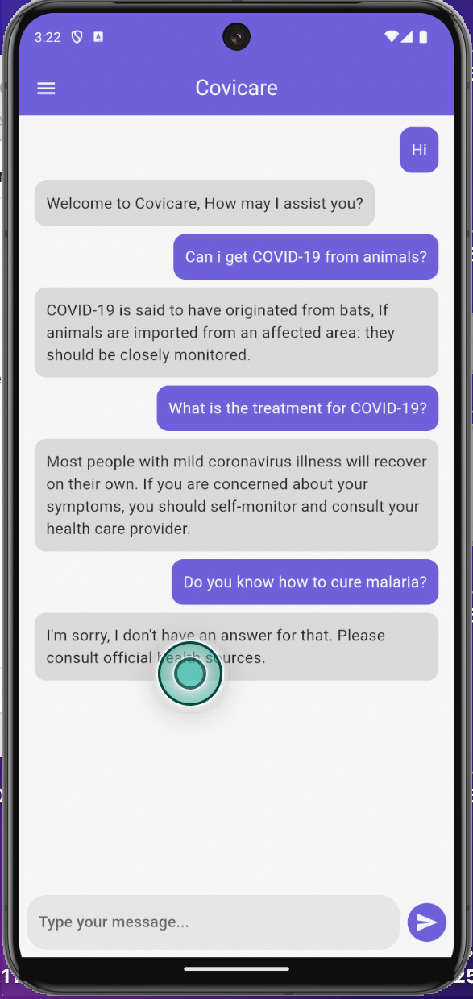

Covicare - COVID-19 Chatbot
===========================

📌 Project Overview
-------------------

This project implements a **COVID-19 chatbot** using a **fine-tuned BERT model** to answer COVID-related questions. The chatbot is trained on a domain-specific dataset and optimized using **hyperparameter tuning** to improve accuracy and response quality. The chatbot can be deployed as an API and integrated into a **Flutter mobile app**.

🌟 Features
-----------

*   **AI-powered Chatbot:** Uses a fine-tuned Transformer model (**BERT**) for answering COVID-19-related questions.
    
*   **FastAPI Backend:** Serves model predictions as a REST API.
    
*   **Flutter Mobile App:** Interactive UI for real-time conversations.
    
*   **Error Handling:** Displays appropriate messages when the API is unavailable.
    
*   **Themed UI:** Uses a **purple color scheme** to match COVID-19 awareness themes.
    

🛠️ Tech Stack
--------------

*   **Backend:** FastAPI, TensorFlow, Transformers
    
*   **Frontend:** Flutter (Dart)
    
*   **Deployment:** Localhost
    

📂 Dataset
----------

*   **Source:** Custom (created based on different conversational pairs that align with COVID-19)
    
*   **Format:** JSON
    
*   **Structure:** Contains **question-answer pairs** related to COVID-19.
    
*   **Preprocessing:**
    
    *   Removed duplicates and missing values
        
    *   Lowercased text
        
    *   Removed special characters
        
    *   Tokenized using **BERT Tokenizer**
        

🤖 Model Training & Fine-Tuning
-------------------------------

*   **Pretrained Model Used:** bert-base-uncased
    
*   **Task:** Question Answering
    
*   **Training Framework:** TensorFlow & Hugging Face Transformers
    
*   **Training Pipeline:**
    
    1.  Tokenization using **BERT Tokenizer**
        
    2.  Fine-tuning on COVID-19 QA dataset
        
    3.  Hyperparameter tuning
        
    4.  Evaluation using **F1-score, BLEU, and Perplexity**
        
    5.  Deployment-ready model saved
 
🔬 Hyperparameter Tuning
------------------------

Fine-tuning a Transformer-based Question Answering (QA) model requires optimizing hyperparameters such as batch size, learning rate, number of epochs, and weight decay. The goal of these experiments was to improve F1-score, BLEU score, and perplexity while avoiding overfitting.

### 🚀 Experimentation Setup

Four key hyperparameters were varied:

* Batch Size: 8, 16, 32
* Learning Rate: 2e-5, 3e-5, 5e-5
* Epochs: 3, 5, 7
* Weight Decay: 0.01, 0.05
  
Each experiment was evaluated based on:

* F1-score (Start & End Positions)
* BLEU Score (measures text similarity)
* Perplexity (lower values indicate better generalization)

### 📊 Experimentation Results

| Experiment | Batch Size | Learning Rate | Epochs | Weight Decay | F1 Score (Start) | F1 Score (End) | BLEU Score | Perplexity |
|------------|------------|---------------|--------|--------------|------------------|----------------|------------|------------|
| Base model | 8          | 2e-5          | 5      | 0.01         | 0.4499           | 0.9090         | 0.8929     | 9.1298     |
| 1          | 8          | 2e-5          | 3      | 0.01         | 0.7758           | 0.9697         | 0.9541     | 2.1662     |
| **2 ✅**   | **8**      | **3e-5**      | **5**  | **0.01**     | **0.9576**       | **1.0000**     | **0.9993** | **1.3079** |
| 3          | 8          | 5e-5          | 7      | 0.01         | 0.9576           | 1.0000         | 0.9993     | 1.3635     |
| 4          | 16         | 2e-5          | 5      | 0.01         | 0.9576           | 1.0000         | 0.9993     | 1.4738     |
| 5          | 16         | 3e-5          | 7      | 0.05         | 0.9576           | 1.0000         | 0.9993     | 1.6090     |
| 6          | 16          | 5e-5          | 3      | 0.05         | 0.9576           | 1.0000         | 0.9993     | 1.5480     |
| 7          | 32         | 2e-5          | 7      | 0.01         | 0.9576           | 1.0000         | 0.9993     | 1.5431     |
| 8          | 32         | 3e-5          | 3      | 0.05         | 0.9576           | 1.0000         | 0.9993     | 1.6574     |
| 9          | 32          | 5e-5          | 5      | 0.05         | 0.9576           | 1.0000         | 0.9993     | 1.4929     |
| 10         | 16         | 2e-5          | 5      | 0.01         | 0.9576           | 0.9697         | 0.9639     | 1.8702     |
| 11         | 8         | 2e-5          | 7      | 0.05         | 0.9576           | 1.0000         | 0.9993     | 1.6848     |
| 12         | 32         | 3e-5          | 7      | 0.01         | 0.9167           | 1.0000         | 0.9993     | 1.8917     |


🏆 **Best Model Configuration:**

**Experiment 2** (Batch Size: **8**, Learning Rate: **3e-5**, Epochs: **5**, Weight Decay: **0.01**)
    
*   **F1 Score (Start):** 0.9576
    
*   **F1 Score (End):** 1.0000
    
*   **BLEU Score:** 0.9993

*   **Perplexity:** 1.3079 (Lowest, indicating better generalization)
    
*   **Model saved as best model** /content/drive/MyDrive/Covid-19/best\_model


📌 Key Observations
----------------------

1. **Increasing epochs improved performance but reached a plateau** after 5 epochs. Beyond this, improvements were marginal, while overfitting risks increased.
   
2. **Higher learning rates (5e-5) led to slight instability,** with some runs showing increased perplexity.

3. **Batch size of 8 consistently provided better generalization** than 16 or 32.
   
4. **Weight decay of 0.01 helped maintain stability,** while 0.05 slightly degraded performance.


🚀 Running Covicare
-------------------

### **1️⃣ Clone the Repository**

```
git clone 
cd covid-19-chatbot

```

### **2️⃣ Deploy the API Locally**

```
uvicorn app:app --reload

```

### **3️⃣ Run the Flutter App**

```
cd covid_chatbot
flutter run

```


💬 Example Conversations
------------------------

<p>
  
  
</p>


📌 Project Structure
--------------------

```
📂 covid-19-chatbot
 ├── 📂 covid_chatbot    # Flutter app
 ├── 📂 data             # Dataset files
 ├── 📂 models           # Saved fine-tuned models
 ├── 📂 notebook         # Jupuyter notebook
 ├── 📂 screenshots      # Demo app screenshots
 ├── README.md           # Project Documentation
 ├── app.py       # API Deployment Script

```

📽️ Demo Video
--------------

[Watch Here](https://drive.google.com/drive/folders/1Q3mIk5a8cK-EH2TpP6wdNlA65cygx2PS?usp=sharing)

* * * * *

📌 **For more details, check the full repository!** 🚀
